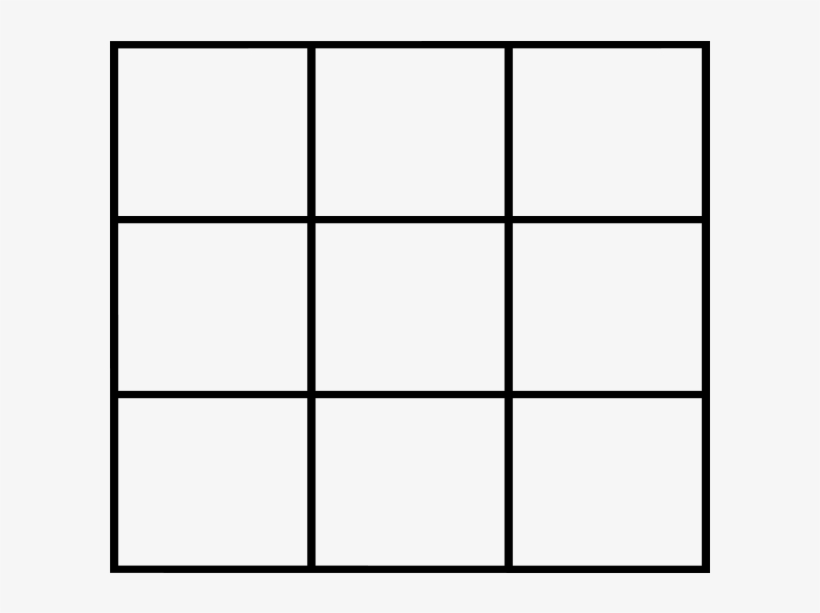

# TicTacToe
Just a little project to improve my knowledge on python, not something too fishy 

Rules :

- 2 players (X and O)
- Board is 3x3
- You win if you manage to make 3 of your sign align (could be vertical, horizontal or diagonal)

How to play : 

- Choose name for both players
- The game chose randomly who start
- The first player chose to put is sign on a case, then the second player do the same until the game is finished by a win or a draw